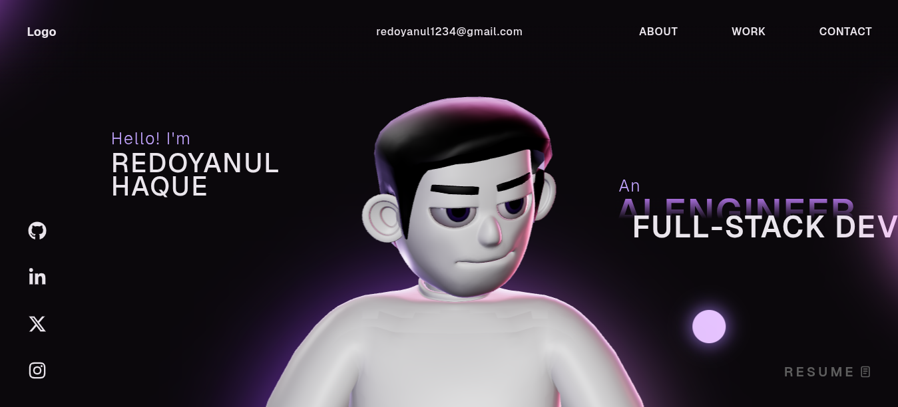

# 🚀 Muhammad Wasif - 3D Developer Portfolio

[](./screen-capture%20(13).webm)

A state-of-the-art, high-performance **3D developer portfolio website** built with **React**, **TypeScript**, **Three.js**, **GSAP**, and **WebGL**.

Welcome to my personal interactive portfolio repository! I am an **AI Engineer & Full-Stack Developer** passionate about building cutting-edge web applications and immersive digital experiences.

> **Live Preview:** [Click Here to View Live (Vercel)](https://portfolio-website-muhammadwasif12345.vercel.app/) *(Update this link if your Vercel URL is different)*

---

## ✨ Highlights

- **Custom 3D / WebGL Avatar** powered by **Three.js**
- Butter-smooth entrance animations & scrolling with **GSAP & Lenis**
- Premium, sleek, modern dark-mode aesthetics
- Fully responsive across desktop, tablet, and mobile browsers
- Clean, modular **React + TypeScript** architecture

---

## 🧰 Tech Stack

- **Frontend Framework:** React, TypeScript, HTML5
- **3D & Rendering:** Three.js, React Three Fiber, WebGL, DRACOLoader
- **Animations:** GSAP (GreenSock), ScrollTrigger, Lenis Smooth Scroll
- **Styling:** Vanilla CSS
- **Deployment:** Vercel

---

## 🚀 Running Locally

Want to run this code on your own machine?

### 1) Clone

```bash
git clone https://github.com/MuhammadWasif12345/portfolio-website.git
cd portfolio-website
```

### 2) Install Dependencies

```bash
npm install
```

### 3) Start Development Server

```bash
npm run dev
```

### 4) Build for Production

```bash
npm run build
```

---

## 🤝 Connect With Me

If you like this project or want to collaborate on something awesome, feel free to reach out!

- **Email:** wasifghori71@gmail.com
- **GitHub:** [MuhammadWasif12345](https://github.com/MuhammadWasif12345)
- **LinkedIn:** [Muhammad Wasif](https://www.linkedin.com/in/muhammad-wasif/) *(Please update this link with your actual LinkedIn profile!)*

---

## ⭐ Support

If you found this codebase useful or inspiring, please give it a **star** ⭐ on GitHub to help others discover it!

---

## 🪪 License

This project is open source and available under the **MIT License**. See [LICENSE](LICENSE).
